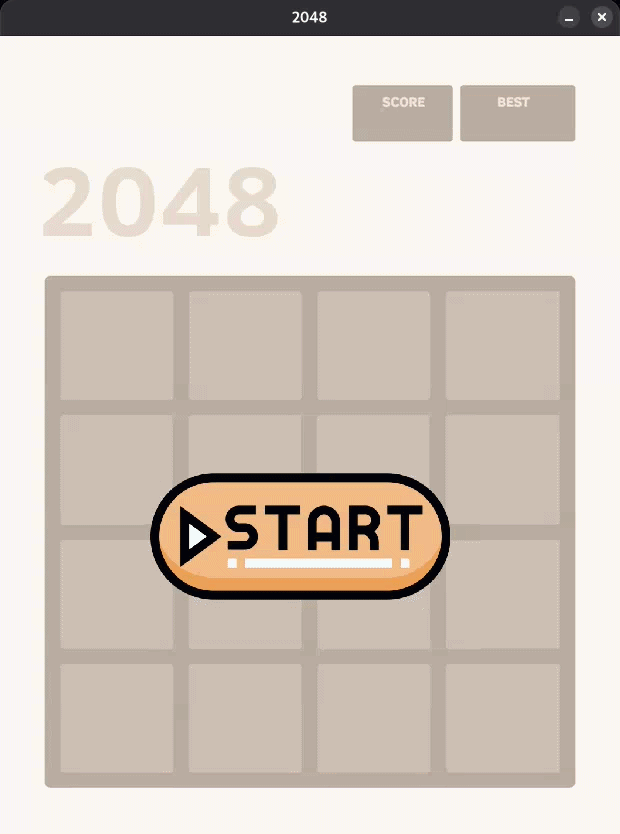

# 2048

A Python implementation of the classic [2048](https://play2048.co/) puzzle game, built with Pygame.




---

## Features

- Classic 2048 gameplay with arrow key controls
- Score tracking with best score persistence (SQLite)
- Game over detection
- Clean tile rendering with custom assets

## Requirements

- Python 3.10+
- pygame
- numpy

## Installation

```bash
git clone https://github.com/<your-username>/2048.git
cd 2048

python3 -m venv .venv
source .venv/bin/activate

pip install -r requirements.txt
```

## Usage

```bash
python3 main.py
```

## Controls

| Key | Action |
|-----|--------|
| ← → ↑ ↓ | Move tiles |
| Mouse click | Start / Restart |

## Project Structure

```
2048/
├── assets/
│   ├── Fonts/
│   ├── Tiles/
│   ├── grid.jpg
│   ├── start-button.png
│   └── game-over.png
├── main.py           # Entry point, event loop
├── game.py           # Game state and rendering
├── puzzle.py         # Grid logic (moves, merges, game over)
├── tiles.py          # Sprite loading and positioning
├── score_manager.py  # SQLite score persistence
├── requirements.txt
└── README.md
```

## How It Works

The grid is a 4×4 NumPy array. On each move:
1. Zeros are shifted out (tiles slide)
2. Adjacent equal tiles are merged
3. Zeros are shifted again
4. A new tile (`2`) is spawned on a random empty cell
5. Game over is triggered when no move is possible

## Author

Christophe Gajean.
Built as a Python learning project.
